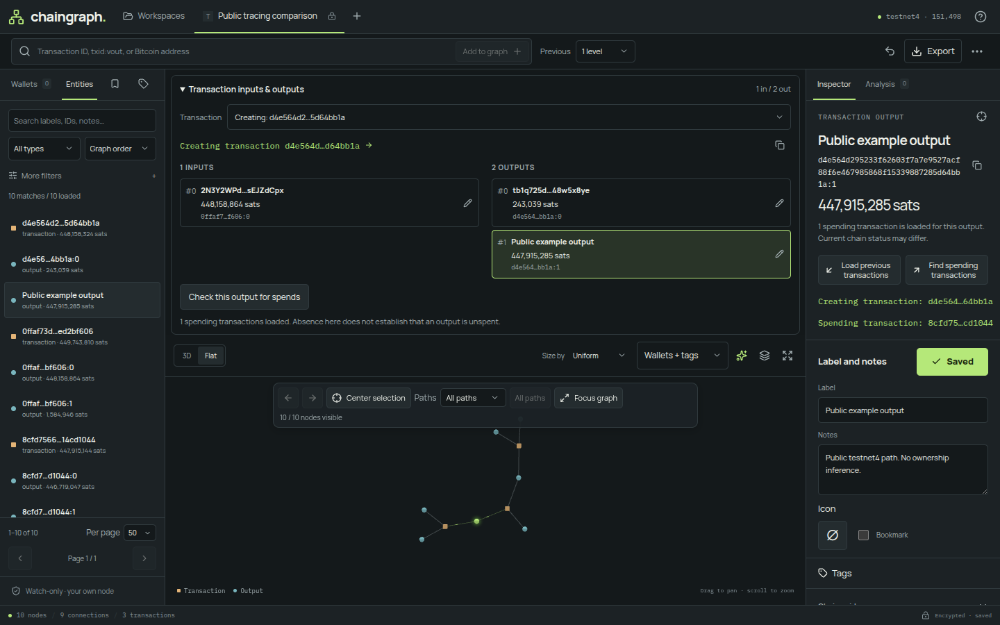

# Chaingraph

A self-hosted Bitcoin analysis workbench for personal wallets and on-chain investigations. Explore transactions and outputs in an interactive 3D graph, follow funding and spending paths, annotate what you find, and compare tentative ownership hypotheses. Workspaces and wallet data live in your browser. Returning-wallet refresh keeps new activity visible until reviewed, without disrupting labels or the current graph selection.

Version 0.2.0 includes multiple encrypted workspaces and watch-only wallets, browser-side receive/change scanning, labels, notes, a searchable icon palette, bookmarks, and BIP329 label exchange. Workspace tags group counterparties independently from labels and notes, while separate wallet-match highlights identify derived addresses and their loaded outputs. The **Tags** panel offers name/description search, immediate editing, expandable members and confirmed deletion. Seven analysis tools cover equal outputs, common-input ownership, address reuse, value flow and fees, consolidation and fan-out, script types, and imported-wallet intersections. Each tool exposes its scope, parameters, assumptions and coverage.

Amounts use exact grouped BTC everywhere: `0.00 025 000 BTC`, `1.00 000 000 BTC`. Amount inputs remain integer sats; fee rates use sat/vB.

Filter the graph by entity type, labels, tags, wallet membership, notes, bookmarks, value and loaded funding/spending evidence. The floating **Filters** popover collects those controls, and removable chips show every active filter beside a **Reset filters** action. Follow a selection's neighborhood, navigate selection history, isolate findings, or use a paginated entity list. Select several entities and apply a label, tag or icon to exactly that set. Wallet and Graph share quick editors with searchable tags, explicit color choices, and responsive rows for long names. Batch labels and icons preserve existing values unless replacement is enabled. Undo and Redo offer up to 15 session-only steps, with tooltips describing the next action. Nine example workspaces offer real transactions across six mainnet and three testnet4 cases with starter labels, tags, icons and bookmarks. Only examples for networks configured on your backend are shown.

The Graph inspector's **Scan** tab searches from a transaction or outpoint for
direct connections and shared ancestors or descendants among nearby loaded,
visible, added or custom-picked nodes. **Neighbours** defaults to the nearest
1,000 connected loaded nodes without direction bias. **Pick target(s)** uses a floating multi-target picker
and targets exactly the picked transactions or outputs. Searches
default to 3 transaction hops, 200 examined transactions,
30 seconds and a 50-branch stopping point. Findings appear during the scan and
can be dismissed individually. Connection and branch-choice cards identify exact
paths and shared meeting points. Automatic scopes compare observed links with the
loaded graph regardless of canvas visibility. Reconnection cards show the path; Add includes the links needed to reveal the complete loop.
Ordinary ancestry and merely loading an identifiable creator are omitted.
Targets in separate loaded components can still yield useful connecting paths. Evidence problems offer a bounded endpoint recheck;
verified unspent, coinbase and unspendable endings live under **Endpoints**.
Scan-wide resource limits appear only in the completion status.
Review exact paths, add a path or an explicit prefix including its terminal creator
in one undoable action, and continue from a stopping point. Clicking a path node
loads it if needed, adds only that node, and selects it.
New scans keep distinct earlier results, with clickable endpoints or input/output
branches in each card. Repeated finding paths, including opposite views of the same loop, update the existing observation; dismissed
paths stay hidden until results are cleared. Results and path evidence stay encrypted; **Clear all results** clears the
collection without removing added paths. The explored search space is discarded. Results are bounded observations, not
exhaustive paths or ownership claims. See [connection scan instructions](instructions.md#connection-scans).



## Docker and Compose

```sh
mkdir -p config
cp -n .env.example config/.env.testnet4
chmod 750 config
chmod 640 config/.env.testnet4
sudo chgrp 1000 config config/.env.testnet4
# Set testnet4 upstreams reachable from the container; add .env.mainnet for mainnet.
docker compose --env-file /dev/null up --build -d
```

Open **http://127.0.0.1:3000**. The container runs without root privileges and Compose restricts the published port to loopback. See [deployment and release instructions](docs/deployment.md) for HTTPS, private CAs, cookie authentication, backups and the GitHub container release workflow. No GitHub repository or published image is assumed yet.

## Run locally

Use Node.js 24 or newer and npm. One backend can serve **mainnet, testnet4, or both simultaneously**, using an isolated Bitcoin Core/Fulcrum pair for each configured network.

```sh
npm ci
cp -n .env.example .env.testnet4
chmod 600 .env.testnet4
# Set testnet4 upstream connection details. Add .env.mainnet for mainnet support.
npm run dev
```

Open **http://127.0.0.1:3001**. The development launcher reads the configured backend port and proxies API calls to it; the browser UI stays on port 3001. Vite receives no upstream credentials. Example workspaces use bundled chain snapshots and need no initial transaction downloads. Network discovery requires the backend; live lookups need both upstream services.

The backend discovers `.env.mainnet` and `.env.testnet4` in the working directory, or in `CHAINGRAPH_NETWORK_CONFIG_DIR` when set. At least one valid file is required. Each file is parsed independently, and its filename selects its network; upstream credentials are never merged into the process environment. `.env` and `.env.live` are not loaded. `dev:live` and `start:live` are aliases for the same discovery-based launchers. RPC accepts either a user/password pair or a cookie file, as shown in [.env.example](.env.example).

Optional exact-output spending acceleration is **off by default**. Set
`CHAINGRAPH_USE_TXOSPENDERINDEX=true` in the relevant isolated network file only
when you want Chaingraph to use an already configured Bitcoin Core 31+
`txospenderindex`. This does not configure Core. Restart the backend and reload
the browser after changing the option. Missing, syncing or unsupported indexes
use bounded Electrum history fallback, with a short retry cooldown. Electrum
still handles address and wallet discovery. A missing spender does not prove an
output is unspent. See [configuration and limits](docs/deployment.md#optional-exact-output-spender-lookup).

The frontend discovers configured networks before creating a workspace and routes every lookup through that workspace’s network. A disconnected upstream does not remove its configured network or disable another pair. Importing or unlocking a workspace for an unconfigured network still opens its saved data for offline inspection and editing. A clear backend-network error explains why live queries are disabled.

To serve the built application from one local origin:

```sh
npm run build
npm start
# Or: npm run start:live
```

Open **http://127.0.0.1:3000** (or the port configured by `SERVER_PORT`). `npm start` serves `dist/` and the API; rebuild after frontend changes. The TypeScript backend runs through `tsx`, so retain the project's installed dependencies.

All launch scripts enable Node's system CA store (`--use-system-ca`), including
npm lifecycle tools through `.npmrc`. Certificates trusted by the operating system
remain verified. A separate private CA can be supplied with `NODE_EXTRA_CA_CERTS`;
TLS certificate and hostname checks are never disabled.

## Data and trust

The backend is a bounded, read-only RPC/Electrum proxy. It stores no workspaces, wallet indexes, labels, or chain-data cache. Address derivation, scan orchestration, analysis, and encryption run in the browser. The proxy and upstreams still see the requested script hashes and transaction IDs.

Workspace names are public so locked workspaces remain identifiable. Optional descriptions, wallets, graph data, and annotations are encrypted before browser persistence and encrypted-file export, using AES-256-GCM and PBKDF2-SHA256. New saves and encrypted exports use authenticated envelope v2 with browser-native gzip when it reduces size. Existing v1 backups remain readable; older app versions cannot read v2. Compression reduces storage size, not the password-derivation cost. Workspace passwords stay in the unlocked browser session; there is no password recovery. Small encrypted saves use localStorage; larger saves use IndexedDB with a compact public index. Browser storage is origin-specific and subject to quota and deletion, so keep exported backups. **BIP329 label exports are plaintext** and can contain extended public keys. See [the user workflow](instructions.md) for the distinction.

This is a trusted, single-user, fully self-hosted application. The backend has **no user authentication** and binds to loopback by default. Public or shared hosting is unsupported. Browser-origin checks and upstream request limits do not provide a user authorization system. Workspace encryption protects saved data, not an unlocked session or untrusted code served to the browser. Web Crypto requires localhost or HTTPS. Saving also requires Web Workers and native gzip CompressionStream/DecompressionStream support; unsupported browsers preserve existing saves and report an error.

Workspace creation shows the eight-character password minimum before submission.
Use the eye buttons to reveal or hide passwords while entering them. Validation
appears inside the dialog. Reloading locks workspaces because Chaingraph never
stores the password; reopen a saved workspace to unlock it. The header **Export workspace**
button saves an encrypted workspace backup; **Export BIP329 labels · plaintext**
in the workspace menu saves unencrypted labels.

## Current boundaries

- Wallet import accepts account-level public keys at depth 3: `xpub`/`ypub`/`zpub` on mainnet and `tpub`/`upub`/`vpub` on testnet4. Supported single-key scripts are legacy P2PKH, nested SegWit, native SegWit, and BIP86 Taproot. Descriptors, multisig, private keys, signing, and spending are unsupported.
- Loaded transactions are a **history snapshot**. Status polling does not refresh every saved confirmation count or detect every reorganization. Scans have address, history, and transaction bounds; a partial result is not proof that no further activity exists.
- CIOH produces a hypothesis. Skipping conspicuous equal-output transactions does not detect all collaborative spends or PayJoin. No tool identifies a person or proves wallet ownership.
- Transactions use cubes, outputs use spheres, and optional addresses use diamonds. Hover a node for details and compact tracing/editing actions; connection lines do not open hover cards. The lookup toolbar defaults to Previous Off, with 1 and 2 levels available, bounded to 500 downloads per action. Loaded spending transactions can carry validated previous-output values and scripts without loading or displaying every creating transaction. Selecting an input still loads only its creating transaction when needed. Use **Load missing input details** in the flow panel for a bounded batch when enriched details are unavailable. Automatically fetched parents initially show only relevant outputs in the graph, keeping unrelated branches out of the current view. Workspaces share the main header; Help and samples holds the tour, examples and About. Graph navigation floats over the canvas. The Flat graph layout still requires WebGL; the transaction inputs/outputs panel does not. The entity list provides a keyboard-friendly inspection path. Individual node dragging is disabled because of an upstream pointer-handling issue; camera orbit, pan, zoom, and node selection remain available.
- Tools are extensible through [`src/domain/analysis.ts`](src/domain/analysis.ts). There is no custom-script IDE, Boltzmann implementation, service worker, or WebSocket live feed in this version. Boltzmann-related research and license compatibility remain research work.

The guided tour has a floating **Tour contents** navigator with ten workflow topics. Jump directly to wallet refresh, transaction flow, annotations, tags or other controls. Panel previews are temporary; closing the tour returns to your original layout and selection. Restart it from Help.

Choose an example on the welcome screen or under **Help and samples → Example workspaces**. The usual creation dialog prefills an editable public name and encrypted description; the example fixes the network. Set a password to create an independent, autosaved workspace. The desktop gallery has two rows of mainnet examples and a third testnet4 row, separated by a fine rule; smaller screens use fewer columns. Explore a Whirlpool example, a large WabiSabi CoinJoin, a public xpub wallet, a large-value split, batched outputs and an OP_RETURN message on mainnet. Follow exact spending links, compare a 53-output fan-out or explore a mixed-script spending path on testnet4. The wallet case uses a deliberately published BIP84 test zpub; never deposit funds to its addresses. Its preloaded scan is incomplete and can be continued through your backend. Labels, tags, icons and bookmarks are editable. Snapshots include the starting transaction's direct input data; trace further or refresh through your backend. Confirmation counts describe the snapshot, and missing spending data does not establish current UTXO status.

New examples open with a curated graph of inputs, outputs and relevant transaction paths. Small transactions show all I/O; dense examples start with up to 20 per side, including annotated comparison points. Remaining observations stay loaded for manual expansion. Existing saved copies retain their graph view.

See [template sources and verification](docs/research/workspace-templates.md). Examples are real chain observations, not attributed wallets or proof of ownership. The former synthetic laboratory is no longer offered; existing saved synthetic workspaces remain readable with live lookups disabled.

This branch enables three compact workbenches: **Wallet**, **Graph** and **Analysis**. Graph retains the accepted renderer, Inspector, wallet tabs and transaction flow. Analysis runs all applicable registry tools in one loaded-data scan using **Workspace** (the default), **Selection (Wallet/Transaction/Output/Address)**, or any individual wallet as scope, with individual links to affected outputs, addresses and supporting transactions. Show on graph reveals a selection; explicit isolation exposes a resettable filter. **Isolate**, beside **Lock**, follows the current selection with the same one- or two-hop filter as **Paths**. Turning it off or resetting filters preserves manual hiding. The Trace workbench is disabled for now; saved Trace mode opens Graph. Its source remains available for later work. Shared annotations remain encrypted. See [the workflow](instructions.md#run-analysis) and [proposal validation](docs/experiments/simple-workbenches.md).

### Review a wallet (experimental)

**Wallet** works on one imported wallet at a time and reuses the existing import,
scan and record code. A switcher moves between wallets; **Add wallet** imports
another one. The pencil beside a wallet name, here or in the Graph sidebar, opens
a name-only editor. Names autosave encrypted; the read-only public key stays masked
until explicitly shown. Derivation settings and existing data are unchanged.
The coverage strip states
the last check, partial discovery, used and discovered addresses, loaded versus
known transactions, and the current UTXO count and balance from a verified check.
There is no completeness percentage; when no UTXO check has run, the workbench
says so and offers the action. Completed wallet checks remain available in Graph
with their original timestamp. They clear when switching wallets or workspaces,
refreshing wallet discovery, or locking; missing observations remain unknown.

Row navigation reuses a browser-memory index of loaded transactions and wallet
scripts, avoiding repeated history scans when selecting records in larger wallets.
Newly loaded evidence refreshes the index automatically.

**To review** starts with current UTXOs and used wallet addresses, followed by
earlier receipts, source addresses, refreshed activity, destination addresses and
findings from your last analysis scan. Each
item explains its reason and shows its evidence. Review filters include counts;
larger lists offer an explicit Show more action. The compact transaction flow
separates verified wallet-script matches from **No wallet match** and unknown
prevouts. Unmatched scripts may be undiscovered wallet addresses; transaction
links do not prove who controls an output or exactly which input funded it.
The detail header shows review status beside the title and a shortened identifier; hover
to see the full value or use Copy. A visible guidance callout explains the finding
and suggests relevant actions with a subtle green glow. **Mark reviewed** remains
the primary action. Editing labels or tags keeps the current item open, even if it
no longer matches a metadata filter.
The side toolbar orders **Label, Tags, Notes, Icon**, review actions, **Select related**,
then **Show** and **Isolate**. Show switches to Graph and frames the selection;
Isolate also applies the existing resettable graph isolation. Identifier, tags and
relationship details come before the transaction flow, which starts collapsed and
keeps its transaction chooser in the title bar. From the tabs down, the workbench
uses a centered, responsive width comparable to Graph’s central area. Analysis
uses the same width below its title and divider. A compact toolbar groups scope selection,
**Scan**, **Options** and **Clear findings**, with selection details beneath.
**Options** opens the input-loading setting and scan thresholds in a full-width panel.
Related transactions and outpoints follow. The flow cards are not navigation
targets: use a card's magnifier to **Show on graph**, reveal and frame that transaction or outpoint,
even with selection lock off. **Back to Wallet** returns to the same invoker.
Choose **Mark reviewed** or **Review later**. Previously saved **Source unknown**
decisions remain completed and appear under Reviewed; new decisions use the two
explicit actions. Review later
advances to the next item and sets the deferred item aside in **Show → Review later**;
it remains pending, but is excluded from **To review**. Reopen returns it to To review.
Labels, notes, tags and icons stay visible in the list and details. Adding metadata
does not complete a review or remove an item. Decisions are stored inside the encrypted workspace, so a
refresh keeps them. Only an item whose underlying observations actually changed is
flagged for another look, with the date of your earlier decision. A scan never
resets the queue.

Contextual review help explains why each item is here and what to do next. Used wallet addresses can be labelled by purpose; unused gap-discovery
addresses are not added to the queue. Source and destination guidance asks for a
sender, exchange, shop or recipient the user recognizes, not an inferred identity.
Individual counterparty outputs are no longer offered as new review tasks.
Compatible older output decisions remain as history under **Previous output decisions**,
not as new work to complete.

One Wallet navigation row offers **To review**, **UTXOs**, **Transactions**,
**Addresses**, **Sources** and **Destinations**. All six tabs use the same selectable
list and detail panel, with direct single-entity label, tag and icon editing.
Identifiers and tags stay visible. Address flow contexts automatically show the latest observed related transaction.
Use the transaction selector to inspect another one. Items without a related loaded
transaction show an information box; known unloaded history stays explicit.

**Finding types** in To review is a multi-select, including zero-count categories.
Selected types match by union (OR); counts overlap and are computed before the
type filter, after the other filters. Missing labels, missing tags and neither
are distinct conditions. Clear types selects none; Reset to all types restores
the full catalog. Heuristic categories describe existing scan results, not a new
or automatically run scan. Definitions appear on hover, keyboard focus or a touch tap.

Sources and Destinations group one-hop observations by **address**. Sources are
funding addresses of transactions paying verified wallet scripts; Destinations
are addresses paid by transactions spending verified wallet outputs. Both lists
exclude addresses matching the currently selected wallet. Labels,
tags and icons edit the address, while constituent outpoints and transaction
contexts remain visible records. Missing inputs are resolved in bounded background
batches on opening Sources, with explicit continuation and retry. Unresolved
outpoints and non-address scripts are not shown as counterparty addresses.
No-match scripts are possible counterparties, not
identified owners; names such as an exchange or shop are user annotations.
An address review does not silently acknowledge its individual outputs or another
direction's review. Compatible earlier output decisions remain stored.

**Scan** runs the existing supported analysis on loaded wallet data, separately
from **Refresh**, which checks new chain activity. Opening a flow lazily loads only a bounded set of relevant visible
previous transactions, with cancellation and retry. Cached observations do not
trigger another request or discard Undo; genuinely new evidence follows the
existing invalidation rules. Status distinguishes queued history, address search
limits, unfinished UTXO checks and unavailable inputs rather than labelling
everything partial. No deep scan or backend index is involved.

Filters cover text, labelled or unlabelled, To review, Review later, Reviewed,
tag state, plus visible counts.
Tick rows, Ctrl/⌘ click to toggle, Shift click to select a displayed range, or use
**Select all (N)**. This replaces the selection with the current filtered
results, including rows under Show more. It becomes **Unselect all (N)**, which
clears those matching rows while retaining selections outside the filter.
**Select related** offers exact address
and creating-transaction matches within those same results, with counts shown
before selection. Same transaction can include both wallet outputs and possible
counterparties; it is not an ownership grouping. Batch details replace the single
detail in the same right-side footprint; the list never grows wider. This panel
shows unique targets and hidden-selection warnings beside label, tag and icon
actions. Review queue checkboxes offer the same batch
controls, plus marking the selected items reviewed or deferring them together.
A single item's label editor starts with its current label and replaces it when applied.
Existing labels and icons are preserved unless you tick Replace, and
the number of records that will change is shown first. Each batch is one autosaved
step that a single Undo reverses. Filtering never widens a selection, and switching
wallet or tab clears it.

Review items and rows carry **Show** and **Isolate**; Graph offers **Back to Wallet**.
Shortened addresses and outpoints expose the full value on hover and have a copy control.
When the selected outputs carry
different recorded sources, one sentence notes that combining them in an ordinary
spend would publish that link. This is experimental local behaviour, not a release
claim: there is no spend composer, coin selection, fee estimate, PSBT, signing,
broadcast, exchange integration or privacy score. Grouping items are heuristic
hypotheses with evidence, never proof of common ownership, and a personal label on
a payment never claims who controls an address. See
[proposal and limits](docs/experiments/wallet-review.md) and
[sources](docs/research/2026-09-09-wallet-review.md).

## Renderer experiment

The graph now contains only explicitly added nodes. Clicking a transaction adds
that transaction; clicking an input or output adds that outpoint. Complete transaction
records remain available in the flow panel without automatically displaying siblings.
The icons-only right toolbar adds, hides or removes inputs, outputs, selections and
transaction branches. Removing from the graph keeps evidence and annotations; branch
actions retain shared outpoints. Inputs and outputs form compact, rounded 3D groups
around each transaction. Shared outpoints connect transaction branches through open
corridors, with rounded groups for shared connections in 3D, including after Repack. Only visible nodes determine spacing. New inputs go upstream and new
outputs downstream. Existing positions stay
anchored until **Repack**. Workspace schema v2 saves this explicit membership and
migrates older workspaces while preserving their existing graph.
Small input/output groups adapt their spacing to the number and size of their
nodes, with balanced pairs and compact rings; larger groups keep dense rounded
packing. Each side adapts independently, and onward transaction connections retain
clearance. Use **Repack** to apply this spacing to previously positioned nodes.

This checkout experiments with contextual input/output flow. Selecting a transaction
adds blue brackets to its inputs and green rings to its outputs, with matching
connection colors and a contextual legend. Selecting an outpoint retains the
related transaction chosen in the flow panel. Fresh layouts and explicit **Repack**
favor incoming and outgoing groups on opposite sides; selection changes only
appearance. Saved positions and cameras remain intact, so use Repack to try the
spacing on an existing workspace. Tag, wallet and finding colors retain precedence
on node fills. Small role outlines fade at distant zoom levels. Newly opened branches continue the direction from a connected transaction through
the chosen outpoint. New input/output groups follow that local direction. Placement
uses nearby free space while preserving existing nodes. Shared nodes already inside
a group remain there until Repack. Explicit Repack still organizes the visible
transaction paths along a common axis.

The panel bar includes an icon-only **Motion** toggle before Show labels, enabled by default for the
mounted graph. It controls directional dots and camera inertia. Hovering a node or
connection and selecting nodes activates the related creation/spending connections;
adaptive dot density limits visual clutter. Dots indicate transaction
direction. Expanded transaction paths animate across the visible upstream/downstream
trace; terminal branches fill a target of 50 per direction with a stable spatial spread.
Larger scopes use fewer dots per connection so expanded paths remain animated.
Motion off preserves manual navigation and static node placement.

This isolated branch uses a purpose-built Three.js adapter with grouped transaction
layout and a compact force fallback for other associations. Only newly added nodes
are positioned when extending an investigation; saved nodes remain anchored. The floating toolbar brings Fit, zoom and an explicit
Repack action beside selection history, selection lock and the existing path
filter. Repack rearranges visible nodes, including older saved layouts. There is
no layout picker. Filters and hidden-selection status sit below the controls.
The rest of the workbench remains shared.
See the [renderer architecture](docs/architecture.md#default-flow-renderer) and
[adapter background](docs/experiments/flow-renderer-v2.md).

## Development

See [CONTRIBUTING.md](CONTRIBUTING.md) for isolated worktrees, configurable browser-test ports, frontend-only previews and review expectations. Security reporting and deployment boundaries are in [SECURITY.md](SECURITY.md).

Routine push/PR checks run build/type checks, domain and integration tests, formatting, portability, license notices and release metadata checks. Engine correctness and data integrity are the testing priority. UI polish does not require new E2E coverage or a browser run.

```sh
npm run build             # TypeScript check and frontend build
npm test                  # Domain and integration tests
npm run check             # Portability, build and domain/integration tests
npm run test:live          # Read-only smoke for configured network pairs
npm run test:production:http # Built assets, HTTP headers and network discovery; no browser
```

Browser QA is explicitly scoped. The manual **Browser QA** workflow defaults to the production runtime check; the E2E smoke suite is an opt-in. Local equivalents, when browser QA is requested:

```sh
npx playwright install chromium
npm run test:production   # HTTP checks, real encryption worker and encrypted persistence
npm run test:e2e          # Small smoke suite: app renders, a workspace opens and shows its graph
```

Production checks need a built server, by default on port 4300; `CHAINGRAPH_SMOKE_URL` selects another origin. Release verification runs the narrow production runtime check against the container, without the E2E suite. The E2E suite is deliberately minimal (a couple of smoke tests, not per-feature coverage) so it stays cheap to run and cheap to fix as the UI evolves; it is not a substitute for exploratory browser QA. Passing non-browser checks does not establish visual usability, live upstream health or mobile performance. See [contributor validation guidance](CONTRIBUTING.md#set-up-and-verify) for scope and commands.

See [verified results and limits](docs/validation.md) for automated, live mainnet/testnet4, and production-browser evidence.

The dependency license notices are retained in [THIRD_PARTY_NOTICES.md](THIRD_PARTY_NOTICES.md); regenerate them with `npm run licenses` after dependency updates.

The [review records](docs/reviews/2026-09-08-response.md) and [validation report](docs/validation.md) distinguish implemented features, tested behavior and release limitations.

Read [architecture and extension points](docs/architecture.md), [user instructions](instructions.md), and the [research log](docs/research/2026-09-08-discovery.md). Research notes credit upstream specifications, papers, and libraries; third-party code retains its own license. Chaingraph is MIT-licensed.

## Transaction and script inspection

Transaction rows show input/output counts and a compact confirmation status. Block heights
come from recorded chain observations. **Unconfirmed** means a mempool observation was
loaded; missing information stays **Status unknown**. Refresh to check the current state.

Select a transaction or output to open the collapsible inputs/outputs view above the graph. Selecting an input follows its previous output while retaining the transaction being examined. For a selected output, the transaction chooser includes its creating transaction and all loaded spending transactions. Large lists start collapsed, with expand/collapse controls above the rows and the selected row kept visible. A loaded spend can show a previous output's value, address, and script before its creating transaction is loaded. Selecting an input still loads only its creating transaction when missing. Use **Load missing input details** for a bounded batch when attached evidence is unavailable, with explicit retry or continuation for partial results. Click the central transaction block to select it, or use its label, tag and icon controls to edit it. Historical previous-output content is not current unspent status, and missing spending data does not prove an output is unspent.

Following an input inside a compact parent exposes its input placeholders without
downloading every previous transaction. If the selected input's creator cannot be
loaded, the input stays selected, the displayed transaction remains open, and the
flow shows an error with **Retry previous outputs**.

The Inspector’s **Scripts and raw transaction** section shows saved output script hex and normalized opcodes. **Load raw transaction** explicitly fetches and verifies serialized bytes for scriptSig, witness, version, locktime and size inspection. Raw data stays in memory only for that inspected selection. Script decoding does not execute scripts or verify signatures. See [inspection research and limits](docs/research/transaction-inspection.md).

Edits to labels, notes, icons, bookmarks, tags and workspace details save automatically.
The status bar confirms when the encrypted copy has reached browser storage; locking
flushes pending edits first. Graph camera/layout, filters, selection and transaction-flow
expansion are encrypted and restored when reopening. Export remains an explicit action
for keeping a portable backup. Camera snapshots wait until navigation is idle; workspace
validation and encryption run in a browser worker. Locking, exporting or switching
workspaces captures the latest view first.

The compact transaction flow places inputs and outputs around the current transaction.
Select an output to see adjacent creating/spending transactions and use its arrows to
follow the exact outpoint. Selection resolves only the chosen outpoint; explicit navigation opens its creating transaction. Other input details load through the explicit bulk control.
OP_RETURN outputs show decoded text when possible, with a short preview and expandable,
selectable, copyable full data. Binary data stays hex; script decoding never executes it.
Tags can be searched, created and assigned from **Add or choose tags** in the inspector.
The Inspector groups label, notes, tags, icon and bookmark controls under **Annotations**.
The **Wallet** section below links to matching imported watch-only wallets. On a transaction,
the association means a matching input or output, not ownership of the whole transaction.

Graph hover cards wrap long annotations and metadata within the graph viewport.
Node hover and selection targets extend slightly beyond the visible shapes.
Identifiers use the shared seven-character ends, with the complete outpoint index;
hover the title or identifier for its full value. Actions and close stay right aligned on the top row.

**Lock** keeps the graph centered as you select items anywhere in the
workbench without changing zoom. Center frames the selected node at about 24 pixels wide.
Back and forward change selection without moving the camera or clearing filters.
Isolate fits the complete isolated view. Graph controls independently show or hide labels, tags and icons. On
desktop, **Hide panels** sits beside the 3D/Flat toggle and temporarily hides the
side panels; it is hidden on mobile, where panels already have separate views.

### Filters, multiple selection and batch metadata

The graph toolbar's **Wallets** dropdown matches any checked wallet and combines
with the other filters. **Clear** removes only the wallet restriction. The selection
is saved with the workspace; the same choices are available under **Filters**.

The floating **Filters** popover holds the shared filter set: entity type, labels,
tags, wallet membership, satoshi bounds, loaded spend and funding evidence,
and bookmarks. **More filters** in **Entities** opens the same
controls. Active filters appear as removable chips under the graph navigation,
with **Reset filters** clearing all of them. Manual hiding is separate: its own
chip counts manually hidden entities and restores them, and **Reset filters**
never unhides anything. Isolation appears as its own **Isolated N entities** chip.
Wallet membership comes from derived addresses; it is not proof of ownership, and
a missing loaded spend still means unknown rather than unspent. The canvas amount
threshold and the transaction flow threshold stay independent.

**Show connections (+N)** appears beside filtered results in **Entities** and the
graph's active filters only when extra loaded neighbors are available. The count
shows how many nodes it will add, one connection from the current filter matches.
Selection alone does not change these matches; use **Isolate / Paths** to explore
a selection. These neighbors may fall outside
your filters; manual hiding and the selected path scope still apply.
It does not fetch transactions or recursively expand the graph. Choose **Hide connections** to
return to matches and cancel any unfinished expansion. Numeric Min/Max sats fields
accept whole satoshi amounts; blank fields impose no limit.

Filtering and layout work show a busy status in the graph navigation. You can
change filters while a layout runs; the latest choice replaces obsolete work.
A layout failure keeps the displayed graph available and offers **Retry**.

**Select** in the graph navigation or in **Entities** turns on selection mode,
which adds checkboxes to entity rows and transaction flow rows. Ctrl or Cmd click
toggles an entity on the canvas, in the list and in the flow; a plain click still
inspects and navigates. The floating selection toolbar reports the count, how many
selected entities are not on the canvas, and offers **Select N matching …** for the
current filter scope. Select matching excludes connected context, while a context
entity you select explicitly stays a batch target, and results changing never
grows a selection. Selections are cleared when you
switch workspaces and pruned only when an entity is actually removed.

Label, Tags and Icon share the Wallet quick editors. Batch labels and icons keep
existing values unless you enable replacement. The label editor shows its target
count and single-item editing starts with the current label. Tag rows show full
names, colors and direct membership counts; choose a color before **Create and
assign**. Existing-tag Add/Remove keeps the popup open. Each applied batch saves
automatically and is one Undo step, available from the toolbar or the header.

Choose **Entities → Match graph** to keep the list aligned with the filtered
canvas. The existing visibility modes remain available to recover hidden and
amount-filtered observations. Workspace-name suggestions select automatically
so typing replaces the default.

Use the eye buttons in **Entities**, the Inspector or graph cards to hide individual
entities without losing their annotations. **Hidden** lists them for quick restoration;
**Show all hidden** restores manual visibility. Transactions and explicitly watched
addresses also offer removal. Removing annotated or tagged data asks for confirmation,
and Undo restores a removal. Stopping an address watch retains shared transaction data.
Individual inputs and outputs can be hidden, while complete transaction records stay intact.
Hiding or removing a transaction also hides or removes its inputs/outputs from the graph
when they lose their last connection. Shared connections survive, and **Show all hidden**
restores a hidden group.
The transaction toolbar's Hide/Remove inputs and outputs affect only unconnected
I/O, preserving further connections. Its bottom controls hide all I/O with zero
or one connection, or show all loaded I/O for transactions on the graph.
Show all clears canvas filters and amount limits; manually hidden transactions
stay hidden. These actions keep the camera in place and do not fetch more history.
Adding a creating or spending transaction from the right toolbar keeps the camera in
place, including with Lock enabled. **Center** moves to the selected transaction explicitly.
New branches extend beyond their source input/output sphere with clearance proportional
to its radius, giving large CoinJoins more space without moving existing nodes.

**All amounts** in the graph toolbar and transaction flow controls each view
independently. Both preferences are saved; the flow control hides when its panel
is collapsed. Choose a satoshi threshold to show amounts strictly greater than it; the
selected output and unknown values remain visible. Isolated transaction/address
nodes and prefetched branches cut off by the amount filter are omitted from the
canvas; their data stays in the workspace. The flow reports omitted rows
and offers **Show** to restore them. The entity list stays available for selecting
filtered outputs. **Size by Value** uses a fixed logarithmic radius: 150,000,000
sats has about 2.6 times the diameter of 20,000 sats. Sizes stay stable when
filtering or adding data; perspective still affects their apparent size.

The Inspector's top-bar refresh icon checks an output's current UTXO status. It queries Core
with mempool spends included and shows a dismissible notification that hides after eight seconds.
The timestamped observation remains under **More details** for the current selection.
A missing UTXO result is not treated as proof of spending.

Successful transaction, output and address lookups focus their target even with
Lock off. Successful opening and tracing actions are silent; incomplete results
still explain limits and recovery. **Load previous** reuses already cached input
context. Removing a transaction also removes its unused input
context, including previously expanded context. Shared, independently
added, annotated and wallet-related context is retained. Older saved workspaces
without ancestry provenance are handled conservatively.

Flow arrows are visible on every transaction/output connection. Connections touching
the selected entity use larger arrows and thicker highlighted lines. Address
associations remain undirected.
The expanded flow panel keeps a stable height as selection changes, capped at
340 pixels and half the graph area (46% on narrow screens). Lists scroll inside
the panel; Collapse returns it to its header.

### Browse a wallet

Select a wallet to reveal **Addresses**, **Transactions** and **UTXOs** beside the Inspector.
Transactions includes known history, newest first, including entries whose details
are not loaded yet. Select a row to load it if needed and focus it on the graph,
then switch to Inspector to edit labels, notes, tags or icons. The wallet context
and list remain available.

UTXOs checks already discovered addresses through your backend, including mempool
activity. Results carry a check time and explicit coverage; partial scans or failed
addresses never imply an empty wallet. Refresh to recheck, or check the next batch
for larger address sets. These observations are temporary and do not delete saved
transactions when an output is spent. The old discovered-address list has been
removed from the wallet inspector.

Wallet **Addresses** lists discovered receive and change addresses with their derivation
index and the number of outputs in loaded transactions. Counts include spent outputs
and are not a complete history or current UTXO count. Filter by address, label or
derivation path. Select a row to show the address on the graph, then use Inspector
to edit its metadata. Addresses with no loaded outputs remain selectable; opening
this list does not scan or download transaction history.
