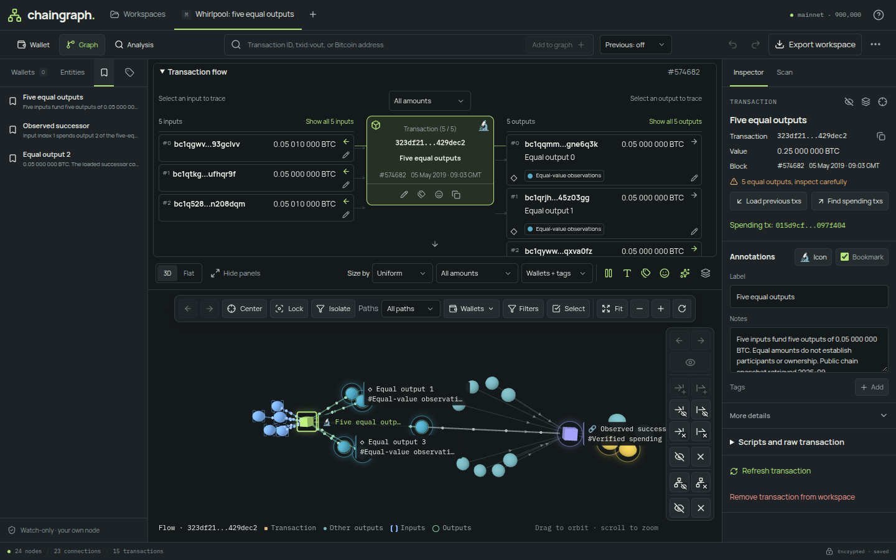
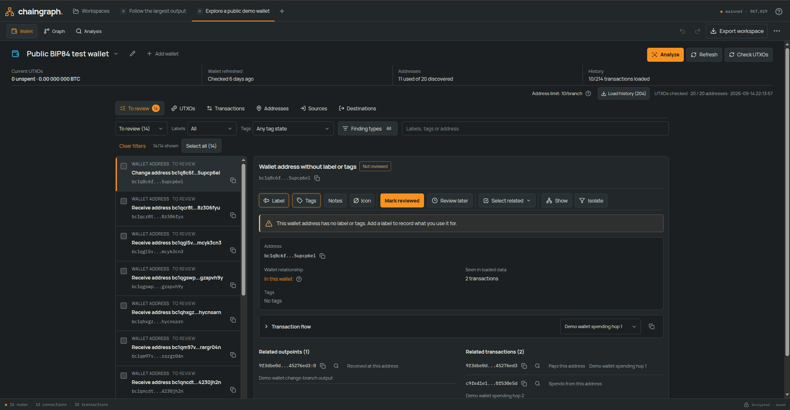

# Chaingraph

Chaingraph is a self-hosted, watch-only Bitcoin workbench for people who want to
understand their own wallets and follow activity on chain. Import an extended
public key, see where your coins came from and where they went, label and tag
what you recognize, and explore transactions in an interactive 3D graph. It runs
against your own Bitcoin Core node and Electrum server, and everything you save
stays encrypted in your browser.



Chaingraph is not an explorer, a custodial wallet or a public service. It never
touches private keys, cannot sign or spend, and does not identify people. Its
analysis tools produce hypotheses with visible evidence, never proof of ownership.

## What you can do

**Review a wallet.** Add one or more watch-only wallets from an account-level
extended public key (`xpub`, `ypub`, `zpub` on mainnet; `tpub`, `upub`, `vpub`
on testnet4). Chaingraph derives receive and change addresses in the browser,
scans their history through your node, and gives you a review queue of current
UTXOs, used addresses, sources and destinations. Work through the queue, label
what you recognize, mark items reviewed or defer them, and refresh later to see
only what changed.



**Explore the graph.** Look up any transaction, address or output. Transactions,
outputs and addresses appear as nodes in a 3D (or flat) graph you can orbit,
filter and extend one step at a time. A compact input/output view shows the
selected transaction, lets you follow an exact output to the transaction that
spent it, and loads missing details on demand. Hover cards, an inspector and a
searchable entity list give you the same actions with mouse, touch or keyboard.
Selecting an address also opens its bounded observed history. The flow panel
has Transactions and UTXOs tabs: history rows and observed unspent outputs can
load their transaction when needed, add or show it in the graph, and open it in
the transaction flow. Balance and last-checked times are shown when available;
missing or partial observations remain explicit and do not prove ownership.

**Annotate.** Labels, notes, icons, bookmarks and colored tags attach to
transactions, outputs and addresses. Edit one item or a whole selection at once.
Undo and redo cover the current session. Labels can be exchanged with other
wallets through plaintext BIP329 files.

**Run analysis.** Seven local tools look for equal-output patterns, common-input
ownership, address reuse, value flow and fees, consolidation and fan-out, script
types, and overlap between imported wallets. Each finding states its scope,
parameters, assumptions and coverage, links to its evidence, and can be shown on
the graph or excluded.

**Scan for connections.** From a selected transaction or output, search nearby
loaded nodes for funding or spending paths, shared ancestors and descendants,
and loops. Results are bounded observations you can add to the graph one path at
a time.

**Start from examples.** Nine example workspaces bundle real mainnet and
testnet4 transactions with starter annotations: CoinJoins, a public demo wallet,
an OP_RETURN message, large fan-outs and more. They open without any downloads
and are only shown for networks your backend has configured.

## Requirements

- A Bitcoin Core node and an Electrum server (Fulcrum is what Chaingraph is
  tested with) for mainnet, testnet4, or both. Each network uses its own pair.
- Node.js 24 or newer for a native install, or Docker with Compose v2.
- A modern browser with WebGL. Encrypted workspaces need a secure context, so
  use `localhost` or HTTPS.

## Install

### Run from source

```sh
npm ci
cp -n .env.example .env.testnet4     # or .env.mainnet, or both
chmod 600 .env.testnet4
# Edit the file with your Bitcoin Core RPC and Electrum connection details.
npm run dev
```

Open <http://127.0.0.1:3001>. The backend reads `.env.mainnet` and
`.env.testnet4` from its working directory (or `CHAINGRAPH_NETWORK_CONFIG_DIR`)
and needs at least one of them. The file name selects the network. RPC accepts a
user/password pair or a cookie file; see [.env.example](.env.example).

For a production build served from one origin:

```sh
npm run build
npm start                            # http://127.0.0.1:3000, or SERVER_PORT
```

### Run with Docker

```sh
mkdir -p config
cp -n .env.example config/.env.testnet4
chmod 750 config && chmod 640 config/.env.testnet4
sudo chgrp 1000 config config/.env.testnet4
# Edit config/.env.testnet4; container loopback is the container itself.
docker compose --env-file /dev/null up --build -d
```

Open <http://127.0.0.1:3000>. The container runs as an unprivileged user with a
read-only filesystem, and Compose publishes the port on loopback only. HTTPS,
private certificate authorities, cookie authentication and upgrades are covered
in the [deployment guide](docs/deployment.md).

## Using Chaingraph

The [user guide](docs/user-guide.md) walks through workspaces, wallets, the
graph, annotations, analysis, connection scans and backups. A short guided tour
is built into the app and can be restarted from **Help**.

Create a workspace with a public name and a password. Everything else in it
(description, wallets, loaded transactions, annotations, analysis results and
your view) is encrypted before it reaches browser storage. Workspaces save
automatically and can be exported as encrypted files for backup or transfer.

## Data and trust

- The backend is a read-only proxy to your Bitcoin Core RPC and Electrum server.
  It stores nothing: no database, wallet, index or cache. The proxy and your
  upstream services do see the script hashes and transaction IDs you look up.
- Address derivation, scanning, analysis and encryption happen in the browser.
  Extended public keys are never sent to the backend as a wallet import.
- Saved workspaces use AES-256-GCM with a PBKDF2-SHA256 derived key. Passwords
  live only in the unlocked browser tab. There is no recovery: keep encrypted
  exports and remember your password.
- **BIP329 label exports are plaintext** and may contain extended public keys.
- The backend has no login and binds to loopback by default. It is meant for one
  trusted user on a trusted machine or behind your own authenticated HTTPS proxy.
  Public or shared hosting is not supported.

## Limits

- Wallet import supports single-key account keys at depth 3 with legacy, nested
  SegWit, native SegWit and Taproot scripts. Descriptors, multisig, private keys,
  signing and spending are out of scope.
- Loaded data is a snapshot. Scans, history and expansion are bounded, and a
  partial result never proves that nothing else exists. A missing spend means
  unknown, not unspent.
- Heuristics are hypotheses. Common-input ownership can be wrong, CoinJoin
  detection is incomplete, and no tool identifies a person or proves a wallet
  owns anything.
- Workspaces are stored per browser origin and subject to browser quotas. Export
  backups before large investigations.

## Documentation

- [User guide](docs/user-guide.md)
- [Deployment and releases](docs/deployment.md)
- [Architecture](docs/architecture.md)
- [Contributing](CONTRIBUTING.md) and [security policy](SECURITY.md)
- [References and attribution](docs/references.md), plus notes on
  [encryption and storage](docs/encryption-and-storage.md),
  [analysis heuristics](docs/analysis-heuristics.md) and
  [example workspaces](docs/example-workspaces.md)

## License

MIT. Third-party dependency notices are in
[THIRD_PARTY_NOTICES.md](THIRD_PARTY_NOTICES.md).
