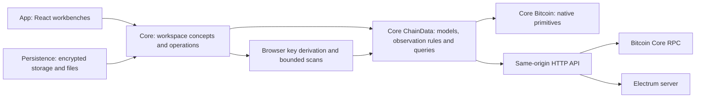

# Architecture

Chaingraph is a browser-owned investigation workspace in front of a bounded,
read-only bridge to Bitcoin Core RPC and the Electrum protocol. The server has no
database, chain index, wallet import or workspace cache. Everything a user
creates lives in the browser, encrypted at rest.

Three principles run through every module:

- **Observations, annotations and hypotheses stay distinct.** Chain data is
  recorded as observed; user labels never alter it; analysis findings are
  overlays with evidence that can be excluded or go stale.
- **Missing is not zero.** An output without a loaded spend is unknown, not
  unspent. A bounded scan that stopped is partial, not empty. Every fetch and
  scan has explicit limits and reports when it reached them.
- **The renderer knows nothing about Bitcoin.** Graph engines receive a neutral
  frame of shapes, colors and links; selection, metadata and workspace logic live
  above them.

## Module map

App owns React UI, presentation behavior and application wiring. Core Workspace
owns framework-independent capabilities grouped by concept. Each concept owns its
canonical types, current schemas and pure validity rules. The Workspace root
composes the aggregate document; `Persistence` owns historical formats, codecs
and physical storage. Canonical validation does not load execution capabilities
or Persistence. Persistence consumes the canonical types and validity rules,
never App or Session implementation. Domain has been removed. Core Bitcoin owns
native mechanisms, Core ChainData owns shared application chain data, and
Workspace owns entity references and account-wallet constraints. Bitcoin
has no application dependencies; ChainData consumes Bitcoin, not Workspace.
Shared display formatting now lives in Core Formatting; UI-specific display
choices, such as entity-removal titles, belong in App. ChainData owns typed Bitcoin RPC
queries, response decoding and fetch scheduling alongside the models they serve.
It remains workspace-independent: Session creates/closes request scopes and owns
accepted workspace publication. Live query files are independently imported and
are not re-exported through the model/validation index, keeping document parsing
independent of transport initialization. No hypothetical adapter layer is introduced.

ConnectionScan is a Core workspace capability. Its retained data and validity
rules live beside its transient search execution, in independently importable files.
Graph owns target selection, presentation and
adding paths to the graph. One canonical plain WorkspaceDocument remains both
live data and the current decrypted file shape; this separation does not create
duplicate storage models. Pure presentation helpers still belong to App.

See [source-map.md](source-map.md) for the directory tree, task entry points and
test locations. Source is grouped by product ownership.

| Location                                                       | Responsibility                                                                      |
| -------------------------------------------------------------- | ----------------------------------------------------------------------------------- |
| `src/App/App.tsx`, `src/App/useAppState.ts`                    | App shell, session navigation, home and dialogs                                     |
| `src/App/Workspace/Workspace.tsx`, `useWorkspace.tsx`          | Shared state, selection, presentation and workbench switching/focus                 |
| `src/Core/Workspace/Analysis/`, `Annotations/`, `Wallets/`     | Analysis, metadata and wallet operations                                            |
| `src/Core/Workspace/ConnectionScan/`                           | Bounded connection scanning                                                         |
| `src/Core/Formatting/`                                         | Shared exact BTC/satoshi formatting and reference abbreviation                      |
| `src/Core/Workspace/workspace.ts`, `chainData.ts`, `view.ts`   | Aggregate document, workspace chain collection and saved view                       |
| `src/Core/Workspace/transactionContext.ts`                     | Context retention, promotion and compact saved input scope                          |
| `src/App/Workspace/Annotations/`, `GraphState/`, `Selection/`  | Editing hooks, Graph projection/actions and transient selection                     |
| `src/App/Workspace/Workbenches/Graph/`, `Wallet/`, `Analysis/` | Each workbench composes its own views and binds shared Workspace state              |
| `src/App/FrontPage/`, `Examples/`, `Help/`                     | Workspace entry, example creation and help                                          |
| `src/App/Workspace/Dialogs/`, `Wallets/Dialogs/`               | Workspace lifecycle and wallet dialogs                                              |
| `src/Core/Workspace/Session/`                                  | Unlocked sessions, undo/redo and save lifecycle                                     |
| `src/App/Workspace/`                                           | React workspace subscriptions, autosave timer and fetch-scope context               |
| `src/Core/Workspace/Persistence/`                              | Public facade, full-cycle document parser and public result/error contracts         |
| `src/Core/Workspace/Persistence/Migrations/`                   | Historical document conversion and legacy membership                                |
| `src/Core/Workspace/Persistence/Codec/`                        | Validation/restoration workflow, envelope, compression and worker execution         |
| `src/Core/Workspace/Persistence/Browser/`                      | Browser index, IndexedDB envelopes and cross-tab publication                        |
| `src/App/Workspace/Workbenches/Wallet/`                        | Wallet overview, records, review UI, scan hooks and preparation cache               |
| `src/App/Workspace/Workbenches/Graph/`                         | Graph surface, side panels, filters, transaction flow and metadata projection       |
| `src/App/Workspace/Workbenches/Graph/Renderer/`                | Renderer-neutral contract, Three.js renderer, layout worker and picking             |
| `src/App/Workspace/Workbenches/Graph/ConnectionScan/`          | Scan panel, target projection, grouping and Graph path-add actions                  |
| `src/App/Workspace/Workbenches/Analysis/`                      | Analysis controls and reports                                                       |
| `src/App/Controls/`                                            | Reused App-owned controls, evidence display and metadata editors                    |
| `src/Core/Bitcoin/`                                            | Native network encodings, public-key derivation, scripts and outpoints              |
| `src/Core/Browser/`                                            | Generic browser mechanisms not owned by workspace persistence                       |
| `src/Core/ChainData/`                                          | Chain models, validity, observation merging, typed RPC queries and fetch scheduling |
| `server/app.ts`, `rpc-schema.ts`                               | HTTP routes, Host/Origin checks, limits, cancellation and read-only RPC allowlist   |
| `server/core.ts`, `electrum.ts`, `config.ts`, `limit.ts`       | Upstream adapters, chain identity, network configuration and concurrency            |

## Browser-owned state

The canonical decrypted `Workspace` model lives with its validation in `workspace.ts`;
its creation factory is independent of storage. `WorkspaceStore` consumes the
public `WorkspacePersistence` contract. `App/appServices.ts` creates one facade
and supplies it to the runtime and file-import UI. Its contract and implementation
share `workspacePersistence.ts`; there are no files distinguished only by case.

The facade exposes list/load/save/remove and encrypted file read/export. A
standalone `parseWorkspace` is the shared full-cycle parser for decrypted saved
documents, including examples that may use historical formats. It migrates,
validates through the canonical workspace rules and applies reopening transitions. Save/export reuse
the same document decoding and validation without interrupting live scans.
File operations and parser use do not initialize browser storage; a denied or
malformed browser index does not prevent opening or exporting portable files.
The session still owns unlocked data, password lifetime, undo and save scheduling.

An explicit public interface need not be a single root index. Bitcoin, ChainData
and workspace concepts allow named-file imports. Persistence and Formatting keep
root-only interfaces; lint prevents outside callers from importing their private
files through type imports, re-exports or literal dynamic imports. Internal imports
remain direct. No Browser/Codec public
indexes or duplicate Persistence/Schema exist. Canonical schema composition
stays with workspace concepts; private envelope/index validation stays beside its actual
codec/storage owner. Tests requiring internal persistence fault injection live
in its module-owned Integration suite; production code cannot depend on that suite.

### Sessions, undo and autosave

An unlocked session holds the workspace and its password in memory only.
Mutations increment a revision; autosave debounces, serializes an encrypted
snapshot in a worker and records which revision reached storage. Saves are
serialized. Graph gestures pause save dispatch, and the renderer coalesces
camera snapshots after 1.2 seconds of quiet. Lock, export and workspace switch
flush the current camera synchronously first. Locking waits for a current save
before dropping the session; a failed save leaves the session open with its
edits.

`Session/chainDataAcquisition.ts` binds acquisition to the original unlocked
session and network. Its `read` operations retrieve transactions, address
observations and spending relations without changing workspace membership.
Its `observe` operations publish accepted data and own refresh, progressive
address-history loading, completed wallet scans and watched-address checks.
Wallet derivation/discovery rules remain in Wallets; Graph keeps navigation,
selection and source eligibility. React supplies progress and interaction guards.
App composes one capability per active session and adapts it through context
for transaction-detail consumers. Captured workspace operations also check the
session token, so callbacks cannot borrow a later reopening of the same ID.

Request order comes from the existing fetch scope, not persisted sequence
numbers. A late older result cannot overwrite a newer accepted observation;
a failed newer request does not suppress an earlier successful response.
Progressive history retains completed checkpoints on cancellation, while bounded
wallet and navigation actions keep their existing completed-result boundaries.

Undo and Redo hold up to 15 session-only steps, each a workspace snapshot with
a description derived by `undoDescription.ts`. Continuous typing in one field
coalesces. Accepted transaction and wallet-observation refreshes carry through
both stacks so undo does not discard downloaded data or erase pending redo.
Explicit user removals remain undoable. Presentation writes (camera, view, scan
results) carry through history. A batch edit is one step.

### Encrypted envelope and storage

`src/Core/Workspace/Persistence/Codec/encryptedEnvelope.ts` fixes AES-256-GCM with PBKDF2-SHA256 at 600,000 iterations,
a fresh 16-byte salt and 12-byte IV per encryption. Imports cannot request
different KDF work. The envelope's own `version` describes encryption and
compression and is independent of the workspace schema version:

| Envelope | Contents                                                                      | Written             |
| -------- | ----------------------------------------------------------------------------- | ------------------- |
| v1       | Raw UTF-8 JSON                                                                | No (still readable) |
| v2       | `compression: "none"` or `"gzip"` (one RFC 1952 member), authenticated in AAD | Yes                 |

Payloads of at least 1 KiB attempt native gzip and keep it only when strictly
smaller. Both `CompressionStream` and `DecompressionStream` must exist for any
save; missing support fails the save rather than downgrading. On read, GCM
authentication completes before a decompressor is constructed; output is counted
in bounded chunks and aborts past the 32 MiB plaintext limit. Buffer zeroing is
best effort, not secure erasure. See
[encryption-and-storage.md](encryption-and-storage.md).

Validation, serialization, compression and encryption run in a single-job
worker (`workspaceCodec.worker.ts`); unlock and import use the same queue
for parsing, decryption, decompression, migration and full wallet-derivation
checks. Errors surface as allowlisted codes, never raw exception text.

Storage keeps a small public index in localStorage: name, identifier, timestamp
and either an inline envelope or a reference to an IndexedDB payload. Envelopes
move to IndexedDB when the estimated index exceeds 1 MiB or a quota error is
raised. Payload writes complete before the index is published; an IndexedDB
readwrite transaction (plus Web Locks where available) serializes index
revision checks across tabs. Saving requires one of those coordinators. The
bounds are 32 MiB plaintext and 100 saved workspaces. Workspace names are the
only user-chosen public metadata; descriptions, wallets, chain data, annotations
and results are inside the envelope.

### Workspace schema and migrations

`CURRENT_WORKSPACE_VERSION` is 6. `WorkspaceDocument` is both the plain encrypted
document and the in-memory document. Chain data, wallet definitions/reviews,
annotations/tags and analysis findings have explicit nested groups; there is no
second flattened runtime model. `workspaceMigrations.ts` transforms supported
flat versionless/v1-v4 and nested v5 payloads before validation. Version 6 groups
transaction placement under `status` and compact input scope under `view.inputContext`.
Only versionless/v1 documents may have graph membership seeded after validation;
v2-v6 require explicit
membership. Migration never invents observation timestamps or sources, mutates
the input, or guesses at null, zero or unknown versions. Unlock never writes a
migration back by itself; the next edited save or export uses the current
schema and envelope v2. Backward-compatible optional observations can be
added within the existing schema contract; a breaking persisted-data change
still requires a version bump, updated types and schema, and deterministic
old-to-new steps with round-trip, failure and preservation fixtures. Migrations
do not belong in components or persistence callbacks.

Every parse validates budgets, Zod shape, network-consistent addresses, prevout
consistency and wallet binding: each supplied address must derive from its
account key, script type, branch and index. Workspaces are bounded to 10,000
transactions and 50,000 transaction/input/output records, 200 tags with 50,000
members and 20,000 wallet review decisions.

## Backend: networks and the read-only bridge

`loadEnvironment` discovers `.env.mainnet` and `.env.testnet4` in
`CHAINGRAPH_NETWORK_CONFIG_DIR` (default: working directory), parses each file
into an immutable per-network configuration and requires at least one. Upstream
credentials never enter `process.env`; `.env` and `.env.live` are not read. An
optional `BITCOIN_NETWORK` in a file must match its name. Shared HTTP settings
(host, port, origins, timeouts, rate limit) come from the process environment.

`GET /api/networks` lists configured networks and capabilities without probing.
`GET /api/status?network=` checks one pair. `POST /api/rpc` requires a `network`
and rejects unknown or unconfigured ones before routing. `server/rpc-schema.ts`
is an explicit allowlist of read-only methods and parameter shapes; Core chain
identity and Electrum genesis are checked per pair. Responses are bounded by
`MAX_RESPONSE_BYTES`, requests by a 16 KiB body limit, and each transport by
configured concurrency and queue depth. Host and Origin are validated against
loopback or `CORS_ALLOW_ORIGINS`. None of this is authentication: the deployment
model is one trusted user. See [deployment.md](deployment.md).

### Optional exact-output spender lookup

`CHAINGRAPH_USE_TXOSPENDERINDEX=true` in a network file lets the server pass
`gettxspendingprevout` (Core 31+) for up to 500 deduplicated outpoints, with
`mempool_only:false, return_spending_tx:false`, and raises that network's body
limit to 64 KiB. Discovery advertises the opt-in, not index health. Failures
pause further attempts for 30 seconds and the browser falls back to bounded
Electrum history. Nothing is cached server-side. `fetchIndexedSpenders`
validates exact outpoint correspondence and candidate transactions before they
join the graph; a missing spender is never evidence of an unspent output. See
[spender-index.md](spender-index.md).

## Chain data in the browser

### Transactions, previous outputs and ancestry

Transactions are fetched with Core `getrawtransaction` verbosity 2 where
available, so inputs carry validated `prevout` value and script without their
parent transaction. `indexPreviousOutputs` / `resolvePreviousOutput` report
`loaded`, `attached`, `missing` or `conflict` per outpoint; conflicts stay unknown
and imported workspaces containing them are rejected. Attached evidence feeds
flow values, wallet matches, filters and analysis but creates no transaction
node.

Selecting an input loads only its creating transaction. **Previous** levels and
**Load previous** use `src/App/Workspace/Workbenches/Graph/Navigation/ancestry.ts`: breadth-first, one or two levels, a
shared 500-download budget, partial results on unavailable branches. The bulk
**Load missing input details** action fetches only parents whose prevout is
missing or conflicting, four at a time, up to 500. Automatically loaded parents
are recorded in encrypted `inputContext` (which outputs the flow uses) and
`contextTransactionIds` (ancestry provenance), so `buildGraph` can show them
without unrelated branches and removal can drop context nothing else needs.

Spending discovery (`loadSpending`) uses the spender index when enabled, then
Electrum script histories, checking at most 500 candidates per action with an
explicit continuation. When no spender is found it asks `gettxout` including
mempool and reports unspent-at-check, absent or unknown.

Address history is a browser-owned observation. Direct address lookups retain a
bounded Electrum history and whether transaction-detail loading reached its
500-transaction limit in `addressHistories`; wallet-derived address histories
remain on their wallet records. `addressHistory.ts` combines those observations
with loaded script-verified outputs and previous outputs to show received, spent,
both or unknown activity. It never infers a balance or ownership. Directly
selected addresses may also have bounded, encrypted `get_balance` and
`listunspent` observations in `addressBalances` and `addressUtxos`, each with a
network and check timestamp. These are fetched on demand for one selected
address, cached for the session/workspace, and refreshed only explicitly. A
missing or failed observation remains unknown. History and UTXO rows can
navigate to an unloaded transaction, which is then fetched and explicitly
admitted to the graph. An observed address balance supplies only that address
node's optional graph value for value-based sizing; address nodes are not
traversed by connection scans.

The UTXO projection counts only entries returned by `listunspent`, separating
positive observed heights from height-zero mempool entries. Confirmed UTXO
creating transactions may be loaded, bounded to 500 missing details per
action, so their block timestamps can be displayed; a missing timestamp remains
unknown rather than being inferred from the UTXO height.

For a selected or directly looked-up address, the browser admits and selects the
address before loading its history details when no direct history is available.
The bounded raw history observation is persisted
as soon as it arrives, then transaction details are persisted in small
progressive batches. Jobs are keyed by workspace, network and address, may
continue after selection changes, and are cancelled when the workspace changes.
The backend remains a bounded read-only proxy with no address-history jobs or
cache.

Optional encrypted `blockHeight` and `mempool` fields are observations. Direct
loads use the containing block header; histories supply Electrum heights. A
bounded 512-entry blockhash-to-height map per network caches immutable
coordinates, never active-chain status. Sources are listed in
[references.md](references.md).

### Wallets and scanning

`src/Core/Workspace/Wallets/walletDerivation.ts` accepts depth-3 account keys (`xpub`/`ypub`/`zpub`,
`tpub`/`upub`/`vpub`), derives non-hardened receive (0) and change (1)
branches, and builds P2PKH, P2SH-P2WPKH, P2WPKH or BIP86 P2TR scripts and their
Electrum script hashes. Testnet4 shares testnet encodings, so a key cannot prove
its network. Scanning is client-side: bounded address batches, gap and index
limits, concurrency limits, reuse of loaded transactions, and a retained
continuation queue of skipped transactions. Fetched addresses must be valid for
the workspace network and agree with their scripts. The backend never sees a
whole wallet. See [encryption-and-storage.md](encryption-and-storage.md)
and [performance-notes.md](performance-notes.md).

Refresh records checked bounds, scan time, pending downloads and an unreviewed
transaction queue. Unchanged evidence keeps analysis results usable; changed
evidence invalidates findings. Old annotated transactions are never removed
because a new history omits them. The optional 30-second monitor runs only
while unlocked.

Wallet UTXO checks publish successful native address observations into encrypted
`chainData.addressUtxos`, shared with Graph address checks. Wallets projects those
observations over verified discovered scripts; there is no second persisted
wallet balance or UTXO model. Bounded Electrum `listunspent` queries cover at most
100 addresses per action, with explicit continuation. Loaded-output uses require
an exact amount/script match. Failed address checks retain earlier observations
and do not renew their dates. The displayed aggregate date is the oldest
contributing check, so refreshing one page cannot make older pages look fresh.
Reopening displays saved coverage and dates without automatically refreshing a
retained check. React owns only request, error and continuation state; lock drops
decrypted data and cancellation state, not the encrypted observations.

Wallet reconciliation excludes saved UTXOs with exact loaded spenders from the
current candidate list and current-UTXO recommendations. The native saved check
and review decision remain intact; a new check date alone does not invalidate a
review fingerprint. Coverage distinguishes loaded-spender conflicts from malformed
output evidence and points to the existing Check UTXOs action. This does not
assert that a loaded historical spender remains in today's chain or mempool.

### Request scheduling

`src/Core/ChainData/transactionScheduler.ts` coordinates transaction fetches: 12 physical jobs
globally, 8 per network, at most 3 per network for background work so explicit
navigation keeps capacity. Navigation precedes visible input evidence, which
precedes refresh and counterparty lookups. The queue holds 128 jobs with the
last 16 reserved for navigation; each job fans out to at most 64 consumers, each
receiving a deep copy. Identity includes the session token, network, transaction
ID, history height and an observation token, so a refresh never joins an earlier
observation. Each session owns a fetch scope whose abort cancels every leaf
request on lock. There is no resolved-transaction cache or TTL.

## Graph

### Membership, visibility and removal

The graph shows only explicitly added nodes. Schema v2+ stores
`view.graphNodeIds`; selection admits the clicked node, tracing admits requested
transactions and connecting outpoints, and new examples seed a curated canvas
(all I/O for small roots, up to 20 per side for dense ones). Later selection
does not expand I/O. Address nodes enter only through explicit selection or
lookup.

Manual hiding (`visibility.ts`) stores canonical IDs in the encrypted view and is
independent of filters: resetting filters never unhides. `graphBranch.ts`
computes hide/remove closure over a batch: an outpoint leaves with its
transaction only when no other participating connection survives. Hiding checks
membership minus hidden nodes; removal checks full membership. Removing from the
graph keeps evidence, annotations and geometry. `entityRemoval.ts` plans
workspace-level transaction deletion and address unwatching, counting affected
annotations for confirmation; inputs and outputs are never deleted individually.

### Presentation and adapter contract

`src/App/Workspace/Workbenches/Graph/Renderer/presentation.ts` projects the visible domain graph into a `GraphFrame`:
nodes with stable IDs, shapes (cube, sphere, octahedron), colors, radii,
highlights, optional captions and coordinate hints; links with endpoints,
colors, widths, arrows and a `directed`/`flowSide` hint. Callers supply
`NodePresentation` overrides for tags, wallet matches and findings; selection
color wins, then tag color, then wallet color. Value sizing uses
`1.6 + 0.9 * log10(1 + sats / 10000)`.

The browser remembers its accent preference separately from encrypted workspaces.
`accentTheme.ts` applies it before mounting the app; `GraphView.tsx` observes the
root accent attribute and refreshes presentation colors on the existing renderer.

The application keeps chain topology separate from human metadata. Its bounded
`GraphMetadataProjection` retains unchanged node appearances and projects labels
for inspector and entity-list use without rebuilding chain, wallet or scan indexes.
Bookmarks and notes only invalidate canvas membership when a relevant filter is
active. `GraphPresentationUpdates` projects changed visible appearances and uses
the optional `updateNodeAppearance` adapter method for caption, color and highlight
patches. The Three.js renderer updates those node instances without restarting
layout, edges, flow particles or camera persistence; pending layouts retain patches.
Topology, selection, sizing and other global changes still use complete frames,
as do adapters without the patch method.

`Renderer/adapter.ts` defines `update`, `resize`, `focus`, `fit`, `dispose`,
optional `flushSnapshot`, `zoom`, `repack`, `setMotion`, and events for
hover/select (`{ type, id }` plus pointer coordinates and modifiers), activity
(pauses autosave), layout status and WebGL errors/recovery. Adapters own
picking, camera, gestures, layout and GPU resources. `GraphView.tsx` owns
semantic hit lookup, selection routing, hover cards, keyboard details, floating
navigation, toolbar/legend slots and resize observation. Node dragging is
disabled because of an upstream pointer-event incompatibility; the entity list
is the keyboard and no-WebGL path. Camera and node coordinates are saved as a
bounded renderer-neutral snapshot inside the encrypted view.

### Flow renderer

`Renderer/defaultAdapter.ts` selects `FlowRenderer`, a purpose-built Three.js
instanced renderer. Picking uses exact mesh hits first, then a 25% padded
fallback shared by hover and tap.

Layout runs in `flowLayout.worker.ts`. `groupedFlowLayout.ts` places the
transaction skeleton first (topological X order for fresh components), then
terminal inputs and outputs in rounded groups on opposite sides, sized by
member radii; up to eight members use balanced singleton/pair/ring footprints,
larger sides use collision-aware packing lifted onto a rounded shell. Shared
outpoints are single nodes bridging transactions. Incremental placement keeps
every cached coordinate exact, leaves a new branch along the clicked outpoint's
outward ray with at least one group radius of clearance, and never reserves
space for undisplayed siblings. Remaining associations use a stopped
`d3-force-3d` simulation anchored to grouped positions. Only visible nodes
affect spacing. **Repack** rebuilds the visible layout. A newer topology request
terminates obsolete worker work; views with cached positions restore without
simulation; worker failure keeps the scene and offers Retry. Flat mode keeps a
planar footprint.

`flowContext.ts` marks the selected transaction's inputs and outputs with
screen-space brackets/rings and colored edges; `flowSelection.ts` walks visible
creation/spending links upstream and downstream from the active node without
reversing into sibling branches, targeting 50 terminal branches per direction;
`flowParticles.ts` animates the chosen segments with adaptive dot density
(about 400 particles). Motion is transient GraphView state, on by default, and
never fetches or admits nodes. Engine references are in
[references.md](references.md#rendering).

### Filtering, selection and batch edits

`GraphFilters` holds every user-visible dimension: entity type, label and tag
state, wallet membership, satoshi bounds, loaded spend and funding evidence,
bookmarks, focus hops, isolation and connected context. Membership dimensions
resolve to `includeIds`/`excludeIds` in the workbench using the tag and
wallet-match indexes; the domain filter never derives membership. `activeFilterChips`
and `clearFilterKey` remove one dimension at a time. **Show connections** adds
one-hop loaded neighbours nonrecursively, respecting hiding and the path scope.
Amount thresholds (`smallAmounts.ts`) are strictly greater-than, preserve
unknown and selected values, and drop branches that become detached; the canvas
and flow thresholds are separate encrypted preferences.

The **Entities** panel reads the graph filters and shared selection by default.
Its link toggle can detach panel-only filter state while leaving graph filters,
graph scope and selection unchanged. Re-enabling the link switches the panel back
to the graph's current filter and selection state.

`useEntitySelection` holds selection mode and an ordered ID set as UI state,
cleared on workspace change and pruned only when entities disappear. Adapters
report modifier keys; `GraphView` decides inspect versus toggle. `batchEdits.ts`
contains pure operations that return the same workspace when nothing changes,
canonicalize IDs and write only the targeted field; `batchMetadata.ts` wraps
them for wallet records with preserve-by-default semantics and affected counts.
One batch is one workspace update, one autosave and one Undo step.
`MetadataEditors` and `MetadataPopover` provide the shared quick editors used by
Wallet, Graph and the Inspector; `tagColors.ts` owns the 16 presets.

## Wallet workbench

`walletReview.ts` derives one wallet's queue from loaded observations and an
optional verified UTXO check. Native items declare their factual review scope.
Active analysis findings enter Wallet Review only through their explicit
`subjects`; broader `nodeIds` and `txids` remain evidence. Wallet-relative
projection maps applicable subjects to UTXOs, transactions, addresses, or the
combined sources-and-destinations scope. One finding may produce one row per
applicable scope, but those rows retain one `walletId|link|findingId` decision.
Older subjectless findings remain visible in Analysis and do not enter Wallet
Review until rerun. Counterparties come only from transactions the wallet funded
through loaded prevouts. The queue includes every item supported by the loaded
evidence; coverage reports unloaded sources instead of filling them in. The
Wallet UI renders matching rows 40 at a time without changing the queue, filter
counts or batch-selection scope.

Encrypted `walletReviews` maps `walletId|reason|subject` to `reviewed`,
`unknown` (legacy) or `later`, a timestamp and an evidence fingerprint. Refresh
keeps decisions; only a changed fingerprint re-queues an item, with its earlier
date. Address items key on the verified derivation slot so new receipts do not
undo a recorded purpose. Annotation edits never complete or change an item.
Removing a wallet prunes its decisions.

Factual Wallet rows are not review tasks. `walletRows.ts` links queue items to
records through exact `subjectIds`; factual details expose those links and their
states without owning decision controls. Their **To review** toggle filters records
with outstanding linked work. Exact navigation to the queue uses a transient
relation context instead of search text. Scope projections use distinct row keys,
while all decision mutations deduplicate the persisted review key.

`walletRelationships.ts` projects one-hop counterparties: inputs funding
transactions that paid verified wallet scripts, and outputs of transactions
spending verified wallet outputs, grouped by canonical address and excluding the
wallet's own. Raw script hex is authoritative; histories alone never prove
direction or ownership. `useWalletCounterparties` resolves missing inputs in
bounded batches with explicit continuation. `walletSelectionIndex.ts` builds
per-snapshot indexes of scripts, outputs, spends and prevouts so row selection
does not rescan; `walletRows.ts` is the shared row contract for all six
tabs. `reviewCategoryDefinitions.ts` owns Wallet filter copy, grouping and display
order; `reviewCategories.ts` owns matching, OR semantics and stable total counts.
Wallet **Analyze** reuses the Analysis registry and merge path; it is distinct
from history refresh.

Each unlocked session owns a `WalletPreparationCache` in
`src/Core/Workspace/Wallets/walletPreparation.ts`. It shares one transaction index and script decoder
per current network/transaction snapshot and retains relationships and prepared
review items per wallet. Immutable source references invalidate only dependent
results; camera and workbench changes do not. Initial review and latest UTXO-check
variants are retained separately so returning to a wallet never presents an old
UTXO check as current. Warm returns bypass the preparation placeholder. These
results are not serialized, and successful locking disposes them; save failure
leaves the unlocked session and its preparation intact. The cache does not keep
separate wallet components mounted for every workspace or run analysis in the background.

## Analysis

`analysisTools` in `src/Core/Workspace/Analysis/analysis.ts` is the public registry view.
`toolRegistry.ts` composes one file per tool and owns functional scan order;
`toolGroups.ts` separately owns filter grouping and display order, so presentation changes
do not change execution. A tool declares metadata, source reference and typed parameters;
`analyze(workspace, transactionIds?, options)` returns findings, scope,
summary, coverage and a no-match explanation. Findings carry a stable identity,
algorithm version, explanation, explicit factual subjects, affected evidence
nodes and supporting transactions.
Tools are pure and make no requests. `analysisScan.ts` resolves the selected
transaction, output, address or wallet (or the whole workspace) into loaded
transaction IDs and runs the registry with independent reports and cancellation
between tools. Exclusions survive reruns only with matching support. Analysis
compares each finding's relevant inputs, outputs, resolved previous outputs and
wallet bindings. Observation timing or another confirmation alone does not
invalidate a structure-only finding. Session history carries accepted observation
deltas through Undo and Redo while preserving user-owned membership. Only active, non-stale findings
color the graph, using the last active finding per node. See
[analysis-heuristics.md](analysis-heuristics.md).

The workbench mode (`wallet`, `graph`, `analysis`) is an encrypted view field.
Graph stays mounted while hidden so its adapter, camera and layout survive.
Analysis controls and reports live in a Workspace-owned map pruned on lock or close.
Workspace navigation distinguishes a direct workbench switch from a contextual
handoff and return. A handoff keeps one transient return point containing the
origin workbench and focused control. The destination workbench resolves its own
semantic entry target, such as Graph's stage or Inspector, without exposing its
DOM to Workspace. Show and Isolate promote compact Graph context before
selecting; if an outpoint has no loaded creator, navigation opens a supporting
transaction and says so rather than fetching.

## Connection scans

`src/Core/Workspace/ConnectionScan/connectionScan.ts` runs in the worker beside
it. The same concept owns live/retained run models, result classification,
identity, deduplication, support retention and endpoint rechecks. Graph consumes
these rules rather than maintaining separate copies. Automatic
scopes (`connectionScanNeighbours.ts`: breadth-first over loaded
creates/spends links, up to 1,000 nearest nodes; visible; all added) and custom
picks (`App/Workspace/Selection/connectionScanTargets.ts`: exactly the picked transaction/outpoint IDs,
deduplicated, source excluded, at most 1,000) freeze their targets and the
loaded-link baseline before the run. FIFO fronts alternate source and target
admission per requested direction, with up to four neighbour lookups in flight.
Ready responses are applied serially; a front finishes its current breadth level
before advancing deeper, while other fronts remain free to progress. The worker
bridge reserves transactions against one shared run budget, including overlapping
requests and failed lookups. Pending transaction and UTXO lookups are deduplicated
within the run and aborted on completion. Exhausting the transaction budget stops
admission while allowing already-admitted lookups to finish within the deadline.
Shared ancestors/descendants join
same-direction walks at a meeting point. Automatic connections must add an
observed edge and, for targets in the source's component, retain a distinct
existing route (bounded to 8 transactions) so Add closes a loop; merely loading a
known creator is not a finding.

Defaults are 3 hops, 200 transactions, 30 seconds and a 1,000-branch boundary;
hard limits are 8 hops, 1,000 transactions, 60 seconds, 1,000 branches, 1,000
targets and 50 results, with at most 10 endpoint and 10 evidence-problem paths
per run. Time and depth limits produce a run-level reason, never cards.
Run details show grouped connections found and optional deepest transaction-hop
distance reached from either search side; older saved runs omit unknown depth.
`connectionScanFetch.ts` reuses loaded evidence and the scheduler's background
priority. Downstream indexed spender requests collect up to four exact outpoints
over a 2 ms window, validate the returned evidence against the requested points,
and distribute each spender and unresolved point to the matching lookup.
Candidates beyond the shared budget are skipped without discarding admitted
spenders from the same batch. Script
histories share pending and completed requests by script hash within this run;
failed requests are evicted for retry. This transient lookup state stays in browser
memory and is discarded with the run. An unspent endpoint needs a validated
`gettxout` observation with
creator proof; coinbase and OP_RETURN endings need the actual script bytes.
Typed error codes separate outages from local failures and no upstream text
enters a result.

Core `ConnectionScan/updates.ts` upserts runs in stable order; its record rules deduplicate paths
across runs by source, kind, endpoint, meeting point and directed path
(reconnections by undirected edge union). The encrypted collection is bounded
to 20 runs, 50 results each, 200 extra path transactions and 2 MiB; hitting a
bound rejects the write instead of evicting. Frontier and transport state never
enter the schema. `ConnectionScan/connectionScans.ts` owns the run and collection schemas;
the same validation is reused for live writes and imported documents.
Graph `connectionScanAddition.ts` plans Add and Add prefix as one
Undo step using existing membership APIs; `connectionScanActionEvidence.ts`
fetches at most 20 missing transactions per action with a 30-second deadline;
`connectionScanRetry.ts` rechecks one endpoint under the original bounds without
resuming traversal. Interrupted runs restore as interrupted, never as jobs.
Regression suites and an independent path oracle are described in
[connection-scan-testing.md](connection-scan-testing.md).

## Smaller contracts

**Amounts.** `amountFormat.ts` renders integer satoshis (number or bigint) as
BTC with eight decimals grouped 2/3/3 by thin spaces; `Amount.tsx` adds tabular
digits and the sats tooltip. Nothing else formats money. Fee rates stay sat/vB.
See [references.md](references.md#product-direction).

**Tags and wallet matches.** `tags.ts` indexes tag membership (canonical
transaction/output/address references, address members projecting onto loaded
outputs) and wallet-script matches (raw script over decoded address;
transactions associated through matching outputs or loaded prevouts, never a
heuristic). Both are presentation inputs and do not touch annotations.

**Flow panel.** `FlowPanelShell` is the frame: a collapsible surface and its
height controls, taking a header and a body and knowing nothing about either.
`FlowPanel` chooses the view for what is selected, through an exhaustive switch
that fails to compile when a node kind has no view. The workspace persists the
left and right tabs and collapse state, mobile panel choice, and flow height
under `view.panels`; the toolbar's combined action changes only the two side
panels. A selected unknown outpoint may hydrate its one missing creator while
the flow panel stays collapsed; navigation never changes panel presentation to
trigger data loading. `FlowPanelTransactionView`,
`FlowPanelAddressView` and the wallet stub each supply their own title bar,
status line and body, and keep their downstream components in their own file.
Transaction choice and quick editors have panel lifetime; address tabs and
pagination have address lifetime.
The Inspector derives selected transactions and their loaded relationships through
`relatedTransactions.ts`. `ScriptInspector` renders Core Bitcoin's saved-script
decode; `src/Core/ChainData/rawTransactionInspection.ts` fetches raw bytes on
demand, delegates native decoding to Core Bitcoin, verifies them against the ID
and loaded observations, and keeps them in component memory only. Sources are in
[references.md](references.md).

**UTXO status.** `useUtxoStatus` binds an abortable `gettxout` (with mempool)
to workspace, network and outpoint; results are timestamped, cleared on
selection change and never written to the workspace. See
[spender-index.md](spender-index.md).

**Examples.** `workspaceTemplates.ts` filters a nine-entry catalog by configured
networks; `templateWorkspace.worker.ts` loads the bundled snapshot, adds starter
annotations and validates off the UI thread. Copies get fresh IDs and behave as
ordinary workspaces. A legacy `demo` flag only stops previously saved synthetic
IDs from reaching upstreams. See
[example-workspaces.md](example-workspaces.md).

**Guided tour.** `src/App/Help/steps.ts` lists steps with stable IDs,
copy, target selectors, fallbacks and optional `when` predicates; order is the
array order. `GuidedTour.tsx` overlays a measured spotlight and never launches
scans or edits data. Add a `data-tour` anchor and a step; test direct jumps,
missing targets and narrow viewports.

**Password dialogs.** Create, unlock and import use explicit buttons and Enter
handling rather than form submission, with autocomplete off, to reduce browser
save-password prompts. No guarantee is claimed. See
[encryption-and-storage.md](encryption-and-storage.md#password-dialogs).

## Verification boundaries

`npm test` covers protocol and security boundaries, derivation and encryption,
domain behavior, persistence coordination and scheduler/worker contracts with
synthetic or public fixtures. `npm run build` proves types and bundling. Push
and PR CI run these plus formatting, portability and license checks; no
browser is launched.

`tests/integration/devWorkers.test.ts` also exercises the real Vite development
transforms without a browser. It checks every worker's transitive source imports
for React instrumentation and evaluates the example tag palette without window
globals. React Compiler and Fast Refresh target JSX and `use*.ts` hook modules,
not all of `App`: pure App-owned helpers can also run in workers. The test guards
hook compilation coverage so the narrower filter cannot silently drop existing
memoization. Production builds and SSR example tests alone do not cover this
development-only boundary.

Release verification adds `npm run test:production`: HTTP checks of built
assets, CSP and security headers and network discovery, then a narrow browser
run of the bundled encryption worker under production CSP, a WebGL context, and
encrypted save/reload/unlock/export of a synthetic workspace. `npm run test:e2e`
is a deliberately small smoke suite (the app renders, a workspace opens and
shows its graph).

None of this establishes visual usability, live upstream health, complete
wallet coverage or mobile performance. Those need explicitly scoped browser QA
and read-only checks against real services (`npm run test:live`).
