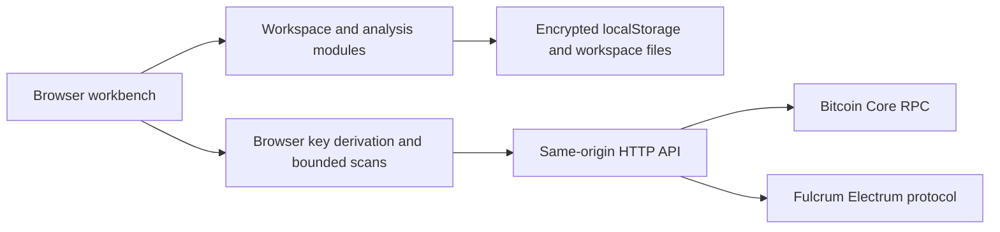

# Architecture

Chaingraph is a client-owned investigation workspace backed by a bounded, read-only bridge to Bitcoin Core RPC and Fulcrum's Electrum protocol. There is no application database, blockchain index, server-side wallet import, or backend workspace cache.

## Module boundaries

| Location | Responsibility |
| --- | --- |
| `src/domain/types.ts` | Workspace, transaction, wallet, annotation, finding, and graph contracts |
| `src/domain/workspace.ts` | Input schema validation and derivation of graph nodes/links from loaded transactions |
| `src/domain/analysis.ts`, `src/domain/analysis/` | Local analysis registry, parameter contracts, scoped evidence and run reports |
| `src/domain/graphFilters.ts` | Shared list/canvas filtering, bounded neighborhoods and explicit connected context |
| `src/domain/demo.ts` | Clearly identified synthetic laboratory fixture |
| `src/lib/wallet.ts` | Account-key validation, receive/change derivation, script construction, and Electrum script hashes |
| `src/lib/api.ts` | Typed HTTP calls, transaction loading, bounded history scans, funding/spending expansion |
| `src/lib/crypto.ts` | Versioned authenticated-encryption envelope and strict envelope decoding |
| `src/lib/useWorkspaces.ts` | Unlocked sessions, encrypted autosave, save status, locking, limited session undo |
| `src/lib/labels.ts` | BIP329-compatible label subset import/export |
| `src/components/GraphView.tsx` | WebGL graph lifecycle and interaction; owns simulation clones, not workspace data |
| `server/app.ts` | HTTP routes, origin/host controls, response limits, cancellation, static app serving |
| `server/rpc-schema.ts` | Explicit read-only RPC method and parameter allowlist |
| `server/core.ts`, `server/electrum.ts` | Upstream protocol adapters and network checks |
| `server/config.ts`, `server/limit.ts` | Validated environment configuration and bounded upstream concurrency/queues |

## State and privacy

An unlocked session holds its workspace and password in browser memory. Mutations increment a revision; autosave serializes an encrypted snapshot after a short debounce and records which revision reached storage. Saves are serialized to avoid races. Locking freezes edits immediately, waits for a current encrypted save, then removes the unlocked session. Failed saves leave the session open. Chain-data refreshes clear snapshot undo history so an old undo cannot discard newly fetched transactions. It is not a guarantee of secure erasure from JavaScript memory.

Encrypted envelopes hold private workspace contents in `localStorage`; the outer saved-entry public name, identifier, and timestamp remain visible. The optional description remains inside the encrypted payload. Old saved entries without a public name are accepted and acquire one after unlock and save. The existing encrypted-file envelope stays compatible; its filename uses the public name. Workspaces are portable through encrypted-file export/import. Imports and unlocks must pass envelope/domain validation and derive every supplied wallet address from its account key, script type, branch and index. Sparse paths derive only supplied indexes. Saving and exporting validate the complete workspace shape before encryption; scanner-produced addresses already pass the derivation boundary. Passwords and plaintext workspaces are not sent to the backend. Plaintext BIP329 export is an explicit separate operation and can include extended public keys.

The version-1 envelope fixes AES-256-GCM, PBKDF2-SHA256 with 600,000 iterations, a fresh 16-byte salt, and a fresh 12-byte IV per encryption. Metadata participates in authenticated additional data. Import cannot request arbitrary KDF work. The plaintext workspace limit is 32 MiB; browser quotas are a separate and usually tighter constraint. See [wallet and encryption research](research/wallet-security.md).

This deployment model trusts the person operating the backend and the JavaScript it serves. There is no backend login, authorization, or tenant isolation. Default loopback binding, browser Host/Origin checks, read-only RPC validation, and request budgets reduce specific exposure; they do not make public hosting supported. An unlocked browser session remains sensitive.

## Networks and scans

Each workspace declares mainnet or testnet4. Each backend process has one configured network and one Bitcoin Core/Fulcrum pair. Core chain information and the Electrum genesis identity are checked before serving relevant upstream data. Workspace switching does not change this server configuration.

Account-level public keys stay in the browser. The derivation module accepts supported extended-key encodings at depth 3 and derives the non-hardened receive/change branches. It builds P2PKH, P2SH-P2WPKH, P2WPKH, or BIP86 P2TR scripts and hashes scripts for Electrum queries. Testnet4 shares testnet key/address encodings, so a key's encoding cannot establish testnet4 provenance. Descriptors, arbitrary derivation paths, and multisig are outside this slice.

Scan orchestration is client-side. It queries addresses in bounded batches, stops using configured gap/index bounds, limits concurrent requests, and reuses workspace transactions where appropriate. The existing client snapshot therefore acts as the hint for avoiding unnecessary downloads. Skipped eligible transactions are retained as a client-side continuation queue; subsequent scans prioritize that queue and missing transactions. The backend remains unaware of complete wallets and does not retain scan progress or chain results. In-flight requests and connection state are operational state, not an application index.

Transaction loading tries Bitcoin Core and then Fulcrum. Spending discovery queries output-script histories (hashing raw scripts, with address fallback) and checks candidate transaction inputs; it cannot establish completeness when an output has no usable script or address or a history/candidate limit is reached. The optional activity monitor polls wallet/address histories every 30 seconds while unlocked. The first implementation polls status over HTTP and does not use Electrum subscriptions or a browser WebSocket feed.

## Graph semantics

The fundamental flow is `transaction → output → spending transaction`. Outputs persist as entities after spending. A missing funding transaction can still have an output placeholder referenced by a loaded input. Optional address nodes describe destinations; they do not imply a wallet or person.

The graph is derived from workspace transactions and annotations. Only active, non-stale analysis findings contribute separate cluster presentation; they do not rewrite the observed transaction graph. When multiple findings reference one node, the current projection uses the last active finding for its display color. The inspector remains the place to review actual findings and evidence.

The renderer clones caller data because the force engine mutates positions and link endpoints. It reuses simulation objects and coordinates across ordinary updates and avoids recreating the WebGL instance on selection. Shared low-poly geometries distinguish transactions (cubes), outputs (spheres), and addresses (octahedra). Hover cards resolve node and link actions to entity IDs; parent callbacks own fetching and annotations. A single points layer draws glow for highlighted entities. Ordinary links use thin lines, with directional arrows on selected incident transaction/output links. Panel resize is observed, pixel density is capped, and simulation work cools after bounded ticks/time.

The Flat graph layout constrains depth and camera rotation while retaining WebGL. The entity list is the alternative interaction path for keyboard access and WebGL failure. Individual node dragging is disabled due a verified upstream pointer-event incompatibility. Camera/layout state is transient, while view settings belong to the workspace. See [rendering research and validation](research/graph.md).

## Analysis extension point

`analysisTools` in `src/domain/analysis.ts` is the extension point. Shared contracts and tool definitions live in `src/domain/analysis/`. A tool declares metadata, an evidence category, source reference and typed parameter descriptors. `analyze(workspace, optionalTransactionIds, options)` returns findings, scope IDs, summary, coverage statistics and a no-match explanation. `run` remains a convenience wrapper returning findings only. Pure tools make no network requests.

The seven built-in tools cover privacy patterns, value/structure and imported wallet intersections. Each finding records stable identity, algorithm version, explanation, affected nodes and supporting transactions. Exact equal-value groups control highlighting. CIOH exclusions are deliberately incomplete; missing input data is explicit, and change-like script patterns remain hypotheses. See [analysis methods and research](research/analysis-tools.md).

The browser passes the visible graph's loaded transaction IDs or the selected transaction as scope. Loaded parents may supply evidence without becoming analysis targets. Reruns replace that tool's results and preserve exclusions only for unchanged node/transaction evidence. Wallet/transaction mutations mark findings stale and remove their overlays. Labels remain independent. Scan completion merges only scan-owned fields into the current wallet, preserving newer user labels. Annotation editor identity is stable across unrelated view/data changes and dirty conflicts require explicit reconciliation.

There is no runtime plugin loader, user-script execution, custom IDE, or Boltzmann computation in this implementation. Any future Boltzmann integration needs algorithm/performance work and a license-compatible implementation decision. Research references are catalogued separately from shipped code in [the discovery log](research/2026-09-08-discovery.md).

## Verification boundaries

Tests focus on protocol/security boundaries, derivation and encryption, domain behavior, and browser workflows. A passing build establishes type/bundle validity; it does not establish a healthy upstream service or a complete wallet scan.

The graph received an isolated Chromium/SwiftShader smoke check with 3,001 frozen synthetic nodes and 3,000 links, React StrictMode, live controls, node picking, and context-loss fallback. This is functional rendering evidence, not a mobile-device or frame-rate benchmark. Overall automated and live-node validation belongs in the implementation report and persistent test suite.

Browser ancestry traversal in `src/lib/tracing.ts` is breadth-first, deduplicates cached transactions, accepts only one or two levels, and shares a 500-download budget across levels. Individual unavailable branches retain successful results and report a partial result. Spending-history continuation is temporary per workspace/outpoint; sorted candidate IDs support bounded next batches, but changes to history can shift boundaries. The laboratory uses the same controls with local fixture data and never sends synthetic transaction IDs upstream.

## Renderer-independent transaction inspection

`TransactionView` projects loaded creating/spending relationships through `domain/transactionInspection.ts`. It uses shared selection, annotation and bounded tracing callbacks; an optional `renderMetadata(nodeId)` slot supports non-interactive tag or wallet badges. The panel occupies normal flow above the renderer and can collapse without changing selection. `ScriptInspector` is a separate inspector section. `lib/transactionInspection.ts` makes an explicit raw transaction request through the existing read-only RPC bridge, validates it against its ID and loaded input/output observations with bitcoinjs, and returns display data. Raw bytes and decoded witness stacks live only in the mounted inspector, with cancellation on transaction changes and unmount. No workspace schema or server cache is added. See [research and validation limits](research/transaction-inspection.md).
